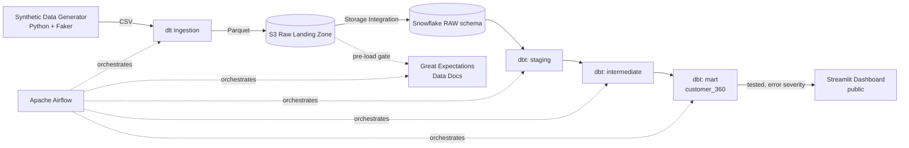

# Customer 360 Analytics Platform

**A production-shaped data platform for retail banking, built on synthetic core-banking data with an FCUBS-style schema.**

🔗 **Live dashboard:** [customer360-bazale.streamlit.app](https://customer360-bazale.streamlit.app)

---

## Why this project

Most "Customer 360" portfolio projects move generic e-commerce data through a pipeline and call it a day. This one is different: it's built on a schema shaped by nearly a decade of hands-on work with Oracle FLEXCUBE core banking systems — CIF-style customer records, GL-adjacent account structures, ISO 8583-flavored card transaction response codes, and KYC lifecycle states that mirror what a real retail bank's data actually looks like.

The goal wasn't just to move data from A to B. It was to encode real banking domain logic — dormancy monitoring, delinquency bucketing, KYC completeness scoring — into a modern data stack, and to prove the pipeline holds up under the kind of dirty, inconsistent data that core banking extracts actually produce.

## Architecture



**Pipeline flow:** synthetic banking data is generated with intentional, realistic data quality faults baked in (null keys, duplicate IDs, orphaned foreign keys, invalid categorical values, out-of-range amounts) → ingested to S3 as partitioned Parquet via dlt → validated pre-load by Great Expectations → loaded into Snowflake → transformed through a three-layer dbt model (staging → intermediate → mart) with tests enforced at each layer → orchestrated end-to-end by Airflow on a daily schedule → visualized in a public Streamlit dashboard.

## Tech stack

| Layer | Tool |
|---|---|
| Data generation | Python, Faker |
| Ingestion | dlt (data load tool) |
| Storage | AWS S3 (raw landing, Parquet) |
| Warehouse | Snowflake |
| Transformation | dbt (dbt-snowflake) |
| Data quality (pre-load) | Great Expectations |
| Data quality (post-load) | dbt tests (schema + custom) |
| Orchestration | Apache Airflow (Docker Compose, LocalExecutor) |
| Visualization | Streamlit, Plotly |
| Deployment | Streamlit Community Cloud |

## The mart: `customer_360`

One row per customer, combining account activity, loan status, and digital engagement into four business-ready signals:

- **`dormancy_risk`** (low / medium / high / unknown) — based on days since last transaction across any account
- **`delinquency_status`** (no_loan / current / watch / arrears / default_risk) — standard banking days-past-due buckets
- **`kyc_completeness_score`** (0 / 50 / 100) — reflects real KYC lifecycle risk, not just a flat status label
- **`engagement_score`** (0–100) — a volume + recency blend of digital channel activity

These aren't arbitrary metrics — they're the kind of fields a real relationship management, collections, or marketing team would actually query against.

## Data quality: two independent layers

This project deliberately uses **two** quality tools doing distinct jobs, rather than one bolted on for show:

1. **Great Expectations** validates the raw extract *before* anything is loaded — a pre-load gate producing a human-readable HTML report (Data Docs), the kind of artifact a data ops team would check each morning before a batch proceeds.
2. **dbt tests** validate the transformed data *inside* the warehouse — `warn` severity at the staging layer (surfacing known source-data issues without blocking the pipeline) and `error` severity at the mart layer (a broken customer record here is a real problem).

Both layers are tested against genuinely injected data quality faults — this isn't a hypothetical demo. A real debugging example: the mart's `customer_id` uniqueness test caught duplicate customer records from a simulated bad batch reload, which required an explicit `QUALIFY ROW_NUMBER()` deduplication step in the transformation logic to resolve.

## Repository structure

```
customer360/
├── generator/          # Synthetic data generation (customers, accounts, transactions, digital events)
├── ingestion/           # dlt pipeline: CSV -> S3 raw landing (Parquet)
├── quality/              # Great Expectations pre-load validation suite
├── customer360_dbt/    # dbt project: staging -> intermediate -> mart
├── dashboard/           # Streamlit app (public dashboard)
└── airflow/               # Docker Compose + DAG for daily orchestration
```

## Running it locally

Each subfolder has its own setup steps. Broadly:

```bash
# 1. Generate synthetic data
cd generator && python3 run_all.py

# 2. Ingest to S3
cd ../ingestion && python3 pipeline.py

# 3. Pre-load quality check
cd ../quality && python3 run_validation.py

# 4. Transform in Snowflake
cd ../customer360_dbt/customer360_dbt && dbt run && dbt test

# 5. Run the dashboard
cd ../../dashboard && streamlit run app.py
```

Or orchestrate the whole thing via Airflow:

```bash
cd airflow
docker compose up airflow-init
docker compose up
# open http://localhost:8080, trigger the customer360_pipeline DAG
```

## About this project

Built by **Ken Bazale** — Data Engineer at Centenary Bank (Blantyre, Malawi), with a background bridging Oracle FLEXCUBE core banking systems and modern data engineering. This project is part of a broader portfolio demonstrating that rare core-banking domain expertise, paired with a current data stack, is a differentiated combination in the global data engineering market.

More at [The Grounded Data Engineer](#) — writing on LinkedIn and Medium about the intersection of core banking systems and modern data infrastructure.